# ⚡ Production-Ready EV Fleet Telemetry Pipeline

### 🚀 The Business Problem
Fleet operators lack real-time visibility into battery health and driver behavior, leading to preventable failures and inefficient routing. Traditional batch processing is too slow (15+ min latency) for critical alerts like thermal runaway or rapid discharge.

### 🛠 The Solution
A scalable, serverless IoT pipeline on AWS that ingests, processes, and visualizes high-frequency vehicle telemetry with **sub-minute latency**, utilizing a **Medallion Architecture** for cost-efficient analytics.

### 🏗 Architecture

```mermaid
graph LR
    subgraph "Edge (Vehicle)"
        V[EV Sensor Node] -->|MQTT| IOT[AWS IoT Core]
    end

    subgraph "Ingestion"
        IOT -->|Rule| FH[Kinesis Firehose]
        FH -->|Raw JSON| S3_B[("S3 Bronze")]
    end

    subgraph "Event-Driven ETL"
        S3_B -.->|S3 Trigger| L[AWS Lambda]
        L -->|Convert to Parquet| S3_S[("S3 Silver")]
    end

    subgraph "Analytics"
        S3_S -->|Crawler| G[AWS Glue Data Catalog]
        G -->|Schema| ATH[Amazon Athena]
        ATH -->|SQL Query| GRAF[Grafana Dashboard]
    end

    style V fill:#f9f,stroke:#333,stroke-width:2px
    style IOT fill:#ff9900,stroke:#333,stroke-width:2px
    style FH fill:#ff9900,stroke:#333,stroke-width:2px
    style S3_B fill:#232f3e,stroke:#fff,stroke-width:2px,color:#fff
    style L fill:#ff9900,stroke:#333,stroke-width:2px
    style S3_S fill:#232f3e,stroke:#00ff00,stroke-width:2px,color:#fff
    style G fill:#232f3e,stroke:#fff,stroke-width:2px,color:#fff
    style ATH fill:#232f3e,stroke:#fff,stroke-width:2px,color:#fff
    style GRAF fill:#fff,stroke:#333,stroke-width:2px
```

#### 🧠 Key Engineering Decisions
Event-Driven ETL: Used AWS Lambda triggered by S3 ObjectCreated events to instantly convert incoming JSON batches to Parquet. This ensures data is query-ready within seconds of arrival.The Lambda function normalizes Unix epoch timestamps into ISO-8601 format to ensure compatibility with Athena and time-series dashboards.

Why Parquet? Converting raw JSON to Parquet reduced Athena query scan size by ~90%, significantly lowering query latency and cost.

Why Kinesis Firehose? Chosen to handle buffering (60s) automatically, preventing the "small file problem" in S3 before the Lambda triggers.

Why Serverless? Eliminated idle compute costs by using AWS IoT Core and Athena instead of provisioning EC2 instances or Kafka clusters.

#### 💰 Cost & Scalability Strategy

The Lambda function only runs when data arrives (Pay-per-execution), eliminating idle EC2 costs.

Partitioning: Data is partitioned by time (Year/Month/Day) to limit query scope.

Storage Tiers: Lifecycle policies configured to move Bronze data to Glacier after 30 days.

On-Demand Execution: The architecture minimizes idle compute by relying exclusively on serverless services (IoT Core, Firehose, Athena), eliminating always-on EC2 infrastructure.

#### 📊 Performance Metrics
Ingestion Latency: < 200ms (Edge to Cloud).

End-to-End Latency: ~60 seconds (Sensor To Dashboard).

Processing Latency: ~3 seconds (Lambda Cold Start + Execution).

Throughput: Tested at 50+ records/second.

#### 🎥 Demo
(Link your video here later)
[Watch the Demo](LINK_TO_VIDEO)

#### 🧪 Simulation Setup
The sentinel_active_node.py script acts as a digital twin, generating realistic telemetry:

Engine RPM: Randomly fluctuates based on throttle position.

Battery Temp: gradually increases with load (simulating thermal stress).

Location: Lat/Long coordinates for route mapping.

## 🔐 Security Considerations

- Device authentication via AWS IoT X.509 certificates.
- Lambda execution role restricted to Silver-layer S3 prefix.
- Athena configured with read-only permissions on curated datasets.
- IAM role separation across ingestion, transformation, and analytics.

### 💻 How to Run
Clone the repo:

Bash
git clone [https://github.com/Mayne0945/ev-telemetry-pipeline.git](https://github.com/Mayne0945/ev-telemetry-pipeline.git)
Install dependencies:

Bash
pip install -r requirements.txt
Run the producer:

Bash
python sentinel_active_node.py
Built with Python, AWS IoT Core, Kinesis Firehose, S3, Glue, Athena, and Grafana.