# ⚡ Enterprise EV Fleet Telemetry Pipeline

### 🚀 The Problem
Fleet operators lack real-time visibility into battery health and driver behavior, leading to preventable failures and inefficient routing. Traditional batch processing is too slow for critical alerts like thermal runaway or rapid discharge.

### 🛠 The Solution
A scalable, serverless IoT pipeline on AWS that ingests, processes, and visualizes high-frequency vehicle telemetry with **sub-minute latency**.

### 🏗 Architecture

```mermaid 
graph LR
    subgraph "Edge (Vehicle)"
        V[EV Sensor Node] -->|MQTT| IOT[AWS IoT Core]
    end

    subgraph "Ingestion & Buffering"
        IOT -->|Rule| FH[Kinesis Firehose]
        FH -->|Batch 60s| S3_B[("S3 Bronze")]
    end

    subgraph "Data Lake & Processing"
        S3_B -->|Glue Crawler| G[AWS Glue Data Catalog]
        G -->|Schema| ATH[Amazon Athena]
    end

    subgraph "Analytics & Viz"
        ATH -->|SQL Query| GRAF[Grafana Dashboard]
        GRAF -->|Alerts| USR[Fleet Manager]
    end

    style V fill:#f9f,stroke:#333,stroke-width:2px
    style IOT fill:#ff9900,stroke:#333,stroke-width:2px
    style FH fill:#ff9900,stroke:#333,stroke-width:2px
    style S3_B fill:#232f3e,stroke:#fff,stroke-width:2px,color:#fff
    style G fill:#232f3e,stroke:#fff,stroke-width:2px,color:#fff
    style ATH fill:#232f3e,stroke:#fff,stroke-width:2px,color:#fff
    style GRAF fill:#fff,stroke:#333,stroke-width:2px
```

⚡ Key Features
Real-Time Ingestion: Handles 50+ records/sec via AWS IoT Core (MQTT).

Scalable Buffering: Uses Kinesis Firehose to batch incoming streams, optimizing S3 write costs.

Schema Evolution: AWS Glue Crawlers automatically detect schema changes from new sensors.

Serverless Analytics: Amazon Athena enables instant SQL querying of raw JSON data without managing servers.

Operational Dashboards: Grafana visualization for live tracking of RPM, Speed, and Battery Temp.

🎥 Demo
(Link your video here later - e.g., YouTube or Loom)
[Watch the Demo](LINK_TO_VIDEO)

💻 How to Run
Clone the repo:

Bash
git clone [https://github.com/Mayne0945/ev-telemetry-pipeline.git](https://github.com/Mayne0945/ev-telemetry-pipeline.git)
Install dependencies:

Bash
pip install -r requirements.txt
Configure AWS Credentials:

Ensure you have ~/.aws/credentials set up or export your keys as environment variables.

Run the producer:

Bash
python sentinel_active_node.py
Built with Python, AWS IoT Core, Kinesis Firehose, S3, Glue, Athena, and Grafana.